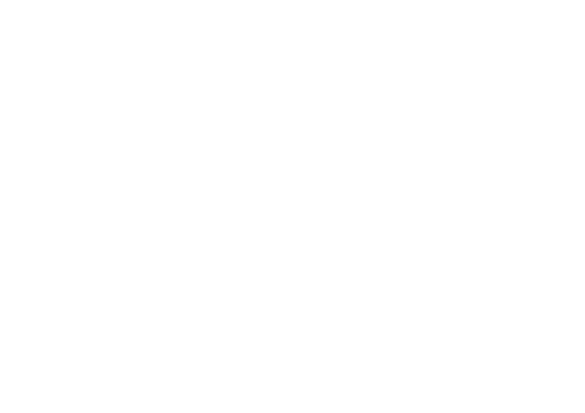

<link rel="stylesheet" href="css/main.css"/>

# Tiny Tent House

This is similar to the idea of a yurt, but much
simpler to construct.

## Goals

* Very easy to build
* Inexpensive
* Comfortable temperature
* Energy efficient
* Electricity only for mobile devices
* Sustainable
* No fuel costs for heating/cooking
* Uses little water

## Basic structure

The shape of the structure is very similar to a Viking tent.
The tent is 16' x 12' and 10'8" in height.  The walls
are angled at 60 degrees.

The outer walls are (mostly white) canvas over 2" denim insulation.

The 16' base beams are reinforced by 12' beams in the center and edges.

## Illustration

### Cross section

## Heating and cooking

The heating and cooking is provided by an indoor
Rocket Stove, ideally an EcoZoom Plancha or possibly
a Silverfire Hunter.  There is a chimney with a wind 
turbine ventilation attached coming out of the top
of the tent.

## Temperature and ventilation

Thermal mass is provided by a 32 gallon trash can used for
extra water storage as well as at least 8 5 gallon water
bottles.  

There is a 2-3" cooling tube used to exchange heat
with the ground to normalize inlet air temperature.

### DIY USB Heat Recovery Ventilator

* Lots of plastic straws
* Hot exhaust straws cross over touching 
cold inlet straws transferring heat
* Two USB fans connected to battery packs

# Bathroom

Ie the rear is a composting toilet and shower/bathing
area with a plastic container for a tub.

## Electricity

Electricity is mobile (USB) only.  Solar is provided by
2-4 14W portable solar panels and stored in 1-20 20000 mAh
mobile lithium ion battery packs.  

In the winter the stove can boil water in a Power Pot
to recharge batteries.

Lighting is provided by USB LED bulbs.
 
## Hot water

Water is boiled on the stove or with solar thermal
boiler and placed in thermos and thermal carafe which
are placed in insulated thermal bag.  

Before going to the bathroom or washing hands, hot water
is poured into basin/bowl.

## Fuel

There is a planter containing a small species of bamboo.
Gray water goes into this planter as much as the
capacity allows for.

